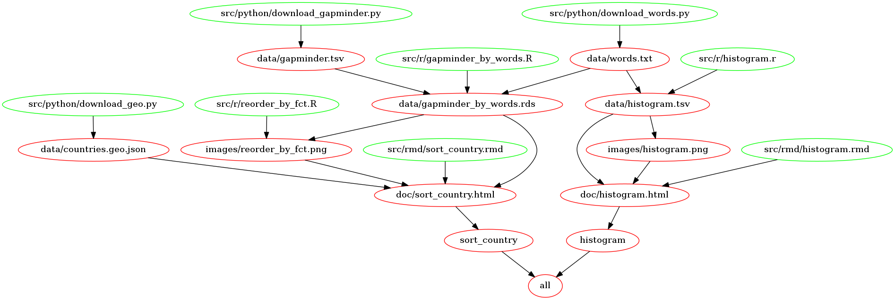

---
output:
  md_document:
    variant: markdown_github
    toc: true
---

```{r, echo = FALSE}
knitr::opts_chunk$set(
  collapse = TRUE,
  comment = "#>",
  fig.path = "README-"
)
```

# STAT 545A Homework 09 Repo owned by Junbin ZHANG

## Overview

**This is the repository for STAT 545A Homework 09 maintained by Junbin ZHANG.** Welcome!

This homework is to build automating data-analysis pipelines based on a existing R project ["make-activity"](https://github.com/STAT545-UBC/make-activity).

This repo contains the following files:

- ["Makefile"](./Makefile) to trigger the pipelines.
- Folder ["src"](./src/) with all source codes inside.
- Folder ["images_keep"](./images_keep/) with images for this file.
- There are three folders that will be removed if `make clean` is run:
  - Folder ["data"](./data/) with downloaded or modified datasets.
  - Folder ["images"](./images/) with all generated images.
  - Folder ["doc"](./doc) with generated HTML files or MD files.

## Automated pipelines

The following figure is generated using [`makefile2graph`](https://github.com/lindenb/makefile2graph) and ["Graphviz - Graph Visualization Software"](https://graphviz.gitlab.io/). The green dots represents source files, and the red dots represent targets (most of them are also files generated in the pipelines). Notice that in this figure, target "clean" is not shown.



### Data downloaded

Three python scripts (under ["/src/python/"](./src/python/)) are designed to download three data sets:

- "words.txt": which contains 235,970 words.
- "gapminder.tsv": instead of using library `gapminder`, we use raw data and parse it as data frame.
- "countries.geo.json": which contains infomation to generate map.

### Data analysis

Two high-level targets (`histogram` and `sort_country`) are defined to perform the following data analysis:

- `histogram`: which is implemented in the orginal project ["make-activity"](https://github.com/STAT545-UBC/make-activity). It shows a histogram of frequencies of letters in a document called "words.txt".
- `sort_country`: it obtains countries in `gapminder` dataframe that also appears in "words.txt", and shows maximum population in different formats.

### Reports

For the above two targets, two HTML files are generated as reports.

- You can refer to ["histogram.html"](https://raw.githack.com/STAT545-UBC-students/hw09-zjbthomas/master/doc/histogram.html) for target `histogram`.
- You can refer to ["sort_country.html"](https://raw.githack.com/STAT545-UBC-students/hw09-zjbthomas/master/doc/sort_country.html) for target `sort_country`.

### Default targets

Two default targets are modified:
- `all`: which runs `histogram` and `sort_country` separately.
- `clean`: which deletes generated folders and files. Thanks to an improved file structure (based on folders), we can simply remove folders ["data"](./data/), ["images"](./images/), and ["doc"](./doc)