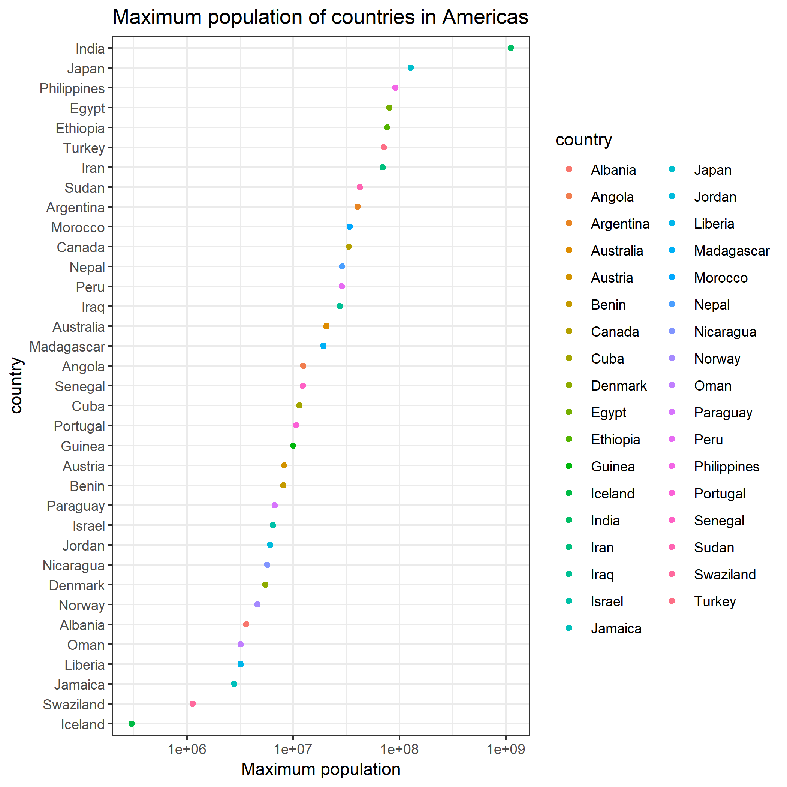

```{r}
# load libraries
suppressPackageStartupMessages(library(tidyverse))
suppressPackageStartupMessages(library(leaflet))
```

# Reorder countries appeared in words.txt by maximum population

The following code is modified based on [my STAT 545A Homework 05](https://github.com/STAT545-UBC-students/hw05-zjbthomas). It is separated into two R files.

- "gapminder_by_words.R" reads `gapminder` database and "words.txt", and generates a new dataframe called 'gapminder_by_words'. It can be used in other analysis pipelines.

- "reorder_by_fct.R" generates the following image using `fct_reorder()`.



# Show maximum population on map using `leaflet()`

The following code is modified based on [my STAT 545A Homework 08](https://github.com/STAT545-UBC-students/hw08-zjbthomas). It generates a map using `leaflet()`, which shows maximum population of different countries.

```{r}
# read RDS
gapminder_by_words <- readRDS("../../data/gapminder_by_words.rds")

## load json for countries boundaries
WorldCountry <-geojsonio::geojson_read("../../data/countries.geo.json", what = "sp")

# convert data to upper case and same format
gapminder_by_words <- gapminder_by_words %>% 
  # mutate to name
  mutate(
    name = toupper(country)
  ) %>% 
  # delete column Country
  select(-country)

WorldCountry@data <- WorldCountry@data %>% 
  mutate(
    name = toupper(name)
  )

# filter not found country
mutate <- WorldCountry[WorldCountry$name %in% gapminder_by_words$name, ]
    
# left join to combine two data frames
WorldCountry@data <- left_join(WorldCountry@data, gapminder_by_words, by = "name")
    
# define color mappings
pal <- colorNumeric(palette = "blue", domain = WorldCountry$max_pop)
    
# create leaflet map
map <- leaflet(WorldCountry) %>%
  addTiles() %>%
  addPolygons(
    fillColor = ~pal(max_pop),
    weight = 1,
    opacity = 0.7,
    color = "black",
    fillOpacity = 1,
    label = stringr::str_c(
      WorldCountry$name,
      " | Maximum Population: ", WorldCountry$max_pop)
    )

# show final map
clearBounds(map)
```